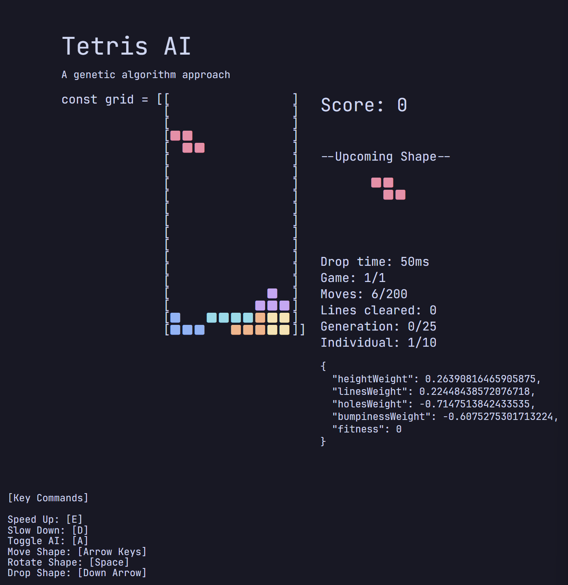

# Tetris: A genetic algorithm approach

This project implements a Tetris game with an AI that uses genetic algorithm to find the optimal tetromino placement to keep the game alive as long as possible.



## Getting Started

### Prerequisites

You must have a Javascript runtime installed on your machine. If you don't have one, you can download and install [Node.js](https://nodejs.org/).

You need to also have a package manager installed. The most popular package manager for Node.js is npm, which comes with Node.js. You can also use [yarn](https://yarnpkg.com/), [pnpm](https://pnpm.io), or [bun](https://bun.sh). I personally recommend using `bun`.

### Installation

1. Clone the repository

```bash
git clone https://github.com/davinjason09/Tetris-Genetics-Algorithm.git
```

2. Install the packages

```bash
npm install
# or
yarn install
# or
pnpm install
# or
bun install
```

3. After installing the packages, you can run the project by running the following command:

```bash
$ npm run dev
# or
$ yarn dev
# or
$ pnpm dev
# or
$ bun dev
```

## Features

- Ability to play the game manually without the AI
- Adjust game speed and pausing the game
- Reset the game

## TO-DO

- [ ] Add the ability to load a pre-trained generation
- [ ] Add the ability to store the generation data
- [ ] Add levels when playing without the AI
